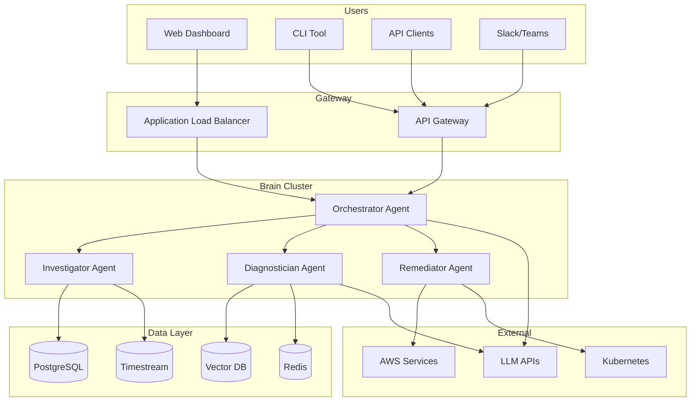
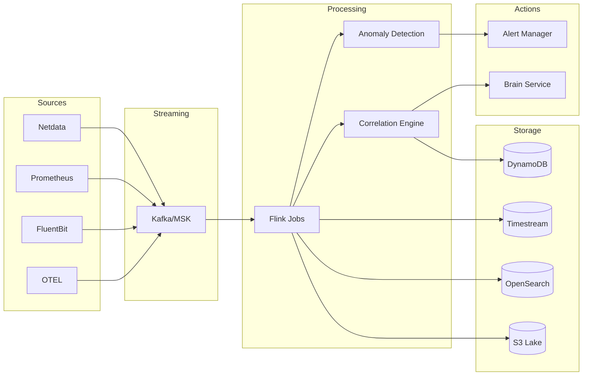
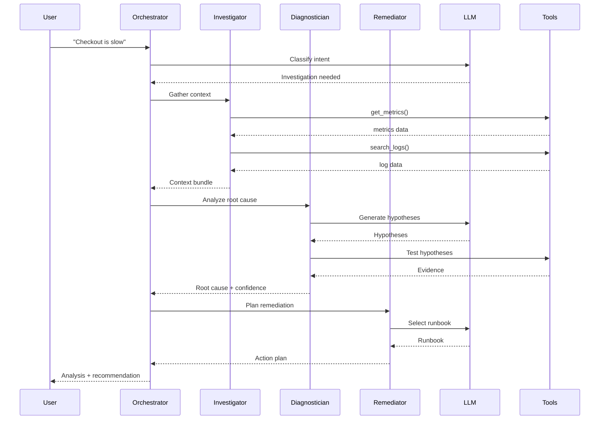

# 📐 Architecture Diagrams - CEREBRO

## Complete Visual Reference

---

## 1. System Context Diagram

```
┌─────────────────────────────────────────────────────────────────────────────────┐
│                         SYSTEM CONTEXT                                          │
└─────────────────────────────────────────────────────────────────────────────────┘

                              ┌─────────────┐
                              │   USERS     │
                              │             │
                              │ • Engineers │
                              │ • SREs      │
                              │ • Managers  │
                              └──────┬──────┘
                                     │
                                     │ HTTPS
                                     │
                              ┌──────▼──────┐
                              │             │
                              │   CEREBRO   │
                              │   PLATFORM  │
                              │             │
                              └──────┬──────┘
                                     │
           ┌─────────────────────────┼─────────────────────────┐
           │                         │                         │
           ▼                         ▼                         ▼
    ┌─────────────┐           ┌─────────────┐           ┌─────────────┐
    │    AWS      │           │ Kubernetes  │           │  External   │
    │  Services   │           │  Clusters   │           │  Services   │
    │             │           │             │           │             │
    │ EC2, RDS,   │           │ EKS, GKE,   │           │ PagerDuty,  │
    │ Lambda...   │           │ On-prem     │           │ Slack, Jira │
    └─────────────┘           └─────────────┘           └─────────────┘
```

---

## 2. Container Architecture

```
┌─────────────────────────────────────────────────────────────────────────────────┐
│                       CONTAINER ARCHITECTURE                                    │
└─────────────────────────────────────────────────────────────────────────────────┘

┌─────────────────────────────────────────────────────────────────────────────────┐
│                              EKS CLUSTER                                        │
│                                                                                 │
│  ┌─────────────────────────────────────────────────────────────────────────┐   │
│  │  NAMESPACE: cerebro                                                     │   │
│  │                                                                         │   │
│  │  ┌─────────────┐  ┌─────────────┐  ┌─────────────┐  ┌─────────────┐   │   │
│  │  │  web-ui     │  │  brain-api  │  │  workers    │  │  scheduler  │   │   │
│  │  │             │  │             │  │             │  │             │   │   │
│  │  │  Next.js    │  │  FastAPI    │  │  Celery     │  │  Celery     │   │   │
│  │  │  3 replicas │  │  5 replicas │  │  10 replicas│  │  Beat       │   │   │
│  │  │             │  │             │  │             │  │             │   │   │
│  │  │  Port: 3000 │  │  Port: 8000 │  │             │  │             │   │   │
│  │  └─────────────┘  └─────────────┘  └─────────────┘  └─────────────┘   │   │
│  │                                                                         │   │
│  │  ┌─────────────┐  ┌─────────────┐  ┌─────────────┐  ┌─────────────┐   │   │
│  │  │  collectors │  │  ml-serving │  │  ws-server  │  │  event-proc │   │   │
│  │  │             │  │             │  │             │  │             │   │   │
│  │  │  OTEL       │  │  Triton     │  │  WebSocket  │  │  Flink      │   │   │
│  │  │  DaemonSet  │  │  2 replicas │  │  3 replicas │  │  3 replicas │   │   │
│  │  │             │  │  (GPU)      │  │             │  │             │   │   │
│  │  └─────────────┘  └─────────────┘  └─────────────┘  └─────────────┘   │   │
│  │                                                                         │   │
│  └─────────────────────────────────────────────────────────────────────────┘   │
│                                                                                 │
│  ┌─────────────────────────────────────────────────────────────────────────┐   │
│  │  NAMESPACE: monitoring                                                  │   │
│  │                                                                         │   │
│  │  ┌─────────────┐  ┌─────────────┐  ┌─────────────┐  ┌─────────────┐   │   │
│  │  │ prometheus  │  │  grafana    │  │  tempo      │  │  alertmgr   │   │   │
│  │  └─────────────┘  └─────────────┘  └─────────────┘  └─────────────┘   │   │
│  │                                                                         │   │
│  └─────────────────────────────────────────────────────────────────────────┘   │
│                                                                                 │
└─────────────────────────────────────────────────────────────────────────────────┘
```

---

## 3. Data Flow Diagram

```
┌─────────────────────────────────────────────────────────────────────────────────┐
│                          DATA FLOW                                              │
└─────────────────────────────────────────────────────────────────────────────────┘

  INGESTION                STREAMING              PROCESSING              STORAGE
  ─────────                ─────────              ──────────              ───────

┌───────────┐            ┌───────────┐          ┌───────────┐         ┌───────────┐
│  Netdata  │────┐       │           │          │           │         │Timestream │
│  Agents   │    │       │           │          │           │    ┌───▶│ (metrics) │
└───────────┘    │       │           │          │           │    │    └───────────┘
                 │       │           │          │           │    │
┌───────────┐    │       │           │          │   Flink   │    │    ┌───────────┐
│Prometheus │────┼──────▶│   MSK     │─────────▶│   Jobs    │────┼───▶│OpenSearch │
│  Scrapers │    │       │  (Kafka)  │          │           │    │    │  (logs)   │
└───────────┘    │       │           │          │           │    │    └───────────┘
                 │       │           │          │           │    │
┌───────────┐    │       │           │          │           │    │    ┌───────────┐
│ FluentBit │────┤       │           │          │           │    └───▶│    S3     │
│  (logs)   │    │       │           │          │           │         │  (lake)   │
└───────────┘    │       └───────────┘          └───────────┘         └───────────┘
                 │              │                     │
┌───────────┐    │              │                     │
│   OTEL    │────┘              │                     │
│Collectors │                   ▼                     ▼
└───────────┘            ┌───────────┐         ┌───────────┐
                         │  Kinesis  │         │ DynamoDB  │
┌───────────┐            │  Firehose │         │  (state)  │
│CloudWatch │───────────▶│           │         └───────────┘
│  Events   │            └───────────┘
└───────────┘
```

---

## 4. Request Flow (Investigation)

```
┌─────────────────────────────────────────────────────────────────────────────────┐
│                    USER INVESTIGATION FLOW                                      │
└─────────────────────────────────────────────────────────────────────────────────┘

  USER                 FRONTEND              BACKEND                 DATA SOURCES
  ────                 ────────              ───────                 ────────────

    │                     │                     │                        │
    │  "Why is API slow?" │                     │                        │
    │────────────────────▶│                     │                        │
    │                     │                     │                        │
    │                     │  POST /api/chat     │                        │
    │                     │────────────────────▶│                        │
    │                     │                     │                        │
    │                     │                     │  query_metrics()       │
    │                     │                     │───────────────────────▶│
    │                     │                     │◀───────────────────────│
    │                     │                     │                        │
    │                     │                     │  search_logs()         │
    │                     │                     │───────────────────────▶│
    │                     │                     │◀───────────────────────│
    │                     │                     │                        │
    │                     │                     │  get_traces()          │
    │                     │                     │───────────────────────▶│
    │                     │                     │◀───────────────────────│
    │                     │                     │                        │
    │                     │                     │  ┌─────────────────┐   │
    │                     │                     │  │    LLM          │   │
    │                     │                     │  │    Analysis     │   │
    │                     │                     │  └─────────────────┘   │
    │                     │                     │                        │
    │                     │  Stream response    │                        │
    │                     │◀────────────────────│                        │
    │                     │                     │                        │
    │  Display analysis   │                     │                        │
    │◀────────────────────│                     │                        │
    │                     │                     │                        │
```

---

## 5. Remediation Flow

```
┌─────────────────────────────────────────────────────────────────────────────────┐
│                       REMEDIATION FLOW                                          │
└─────────────────────────────────────────────────────────────────────────────────┘

  ALERT          BRAIN           APPROVAL         EXECUTOR         TARGET
  ─────          ─────           ────────         ────────         ──────

    │               │               │                │               │
    │  Alert fired  │               │                │               │
    │──────────────▶│               │                │               │
    │               │               │                │               │
    │               │ Analyze &     │                │               │
    │               │ plan action   │                │               │
    │               │               │                │               │
    │               │  [HIGH RISK]  │                │               │
    │               │──────────────▶│                │               │
    │               │               │                │               │
    │               │               │  Human         │               │
    │               │               │  reviews       │               │
    │               │               │                │               │
    │               │  Approved     │                │               │
    │               │◀──────────────│                │               │
    │               │               │                │               │
    │               │  Execute      │                │               │
    │               │───────────────────────────────▶│               │
    │               │               │                │               │
    │               │               │                │  Run playbook │
    │               │               │                │──────────────▶│
    │               │               │                │               │
    │               │               │                │  Result       │
    │               │               │                │◀──────────────│
    │               │               │                │               │
    │               │  Callback     │                │               │
    │               │◀──────────────────────────────│               │
    │               │               │                │               │
    │               │ Update status │                │               │
    │               │ & notify      │                │               │
    │               │               │                │               │
```

---

## 6. Mermaid Diagrams

### 6.1 High-Level Architecture



### 6.2 Event Processing Pipeline



### 6.3 Agent Interaction



---

## 7. Infrastructure Topology

```
┌─────────────────────────────────────────────────────────────────────────────────┐
│                      AWS INFRASTRUCTURE TOPOLOGY                                │
└─────────────────────────────────────────────────────────────────────────────────┘

                                 ┌─────────────────┐
                                 │   CloudFront    │
                                 │   + WAF         │
                                 └────────┬────────┘
                                          │
                                 ┌────────▼────────┐
                                 │     Route 53    │
                                 └────────┬────────┘
                                          │
┌─────────────────────────────────────────┼─────────────────────────────────────┐
│                                   VPC   │                                     │
│                                         │                                     │
│  ┌──────────────────────────────────────┼──────────────────────────────────┐ │
│  │  PUBLIC SUBNETS                      │                                  │ │
│  │                            ┌─────────▼─────────┐                        │ │
│  │                            │       ALB         │                        │ │
│  │                            └─────────┬─────────┘                        │ │
│  │                                      │                                  │ │
│  │  ┌───────────┐  ┌───────────┐  ┌────┴────┐  ┌───────────┐             │ │
│  │  │   NAT     │  │   NAT     │  │   NAT   │  │  Bastion  │             │ │
│  │  │  AZ-1a    │  │  AZ-1b    │  │  AZ-1c  │  │  (SSM)    │             │ │
│  │  └─────┬─────┘  └─────┬─────┘  └────┬────┘  └───────────┘             │ │
│  └────────┼──────────────┼─────────────┼────────────────────────────────────┘ │
│           │              │             │                                      │
│  ┌────────┼──────────────┼─────────────┼────────────────────────────────────┐ │
│  │  PRIVATE SUBNETS (App)│             │                                    │ │
│  │        │              │             │                                    │ │
│  │  ┌─────▼─────┐  ┌─────▼─────┐  ┌────▼────┐                              │ │
│  │  │    EKS    │  │    EKS    │  │   EKS   │                              │ │
│  │  │   Nodes   │  │   Nodes   │  │  Nodes  │                              │ │
│  │  │   AZ-1a   │  │   AZ-1b   │  │  AZ-1c  │                              │ │
│  │  └───────────┘  └───────────┘  └─────────┘                              │ │
│  └─────────────────────────────────────────────────────────────────────────────┘ │
│                                                                                │
│  ┌─────────────────────────────────────────────────────────────────────────────┐ │
│  │  PRIVATE SUBNETS (Data)                                                 │ │
│  │                                                                         │ │
│  │  ┌───────────┐  ┌───────────┐  ┌───────────┐  ┌───────────┐            │ │
│  │  │    RDS    │  │   Redis   │  │OpenSearch │  │    MSK    │            │ │
│  │  │  Primary  │  │  Cluster  │  │  Cluster  │  │  Cluster  │            │ │
│  │  │ + Standby │  │           │  │           │  │           │            │ │
│  │  └───────────┘  └───────────┘  └───────────┘  └───────────┘            │ │
│  │                                                                         │ │
│  └─────────────────────────────────────────────────────────────────────────────┘ │
│                                                                                │
└────────────────────────────────────────────────────────────────────────────────┘

                    VPC ENDPOINTS (PrivateLink)
    ┌─────────────────────────────────────────────────────────────────┐
    │  S3 │ ECR │ Secrets Manager │ KMS │ CloudWatch │ Bedrock │ STS │
    └─────────────────────────────────────────────────────────────────┘
```

---

## 8. Deployment Pipeline

```
┌─────────────────────────────────────────────────────────────────────────────────┐
│                         CI/CD PIPELINE                                          │
└─────────────────────────────────────────────────────────────────────────────────┘

  CODE           BUILD            TEST             DEPLOY           MONITOR
  ────           ─────            ────             ──────           ───────

┌─────────┐   ┌─────────┐   ┌─────────────┐   ┌─────────────┐   ┌─────────┐
│         │   │         │   │             │   │             │   │         │
│  Git    │──▶│ GitHub  │──▶│   Unit      │──▶│   Staging   │──▶│ Smoke   │
│  Push   │   │ Actions │   │   Tests     │   │   Deploy    │   │ Tests   │
│         │   │         │   │             │   │   (ArgoCD)  │   │         │
└─────────┘   └─────────┘   └─────────────┘   └─────────────┘   └─────────┘
                  │               │                   │               │
                  ▼               ▼                   ▼               ▼
             ┌─────────┐   ┌─────────────┐   ┌─────────────┐   ┌─────────┐
             │  Build  │   │Integration  │   │  Canary     │   │  Full   │
             │  Docker │   │   Tests     │   │  Deploy     │   │ Deploy  │
             │  Image  │   │             │   │  (10%)      │   │ (100%)  │
             └─────────┘   └─────────────┘   └─────────────┘   └─────────┘
                  │               │                   │               │
                  ▼               ▼                   ▼               ▼
             ┌─────────┐   ┌─────────────┐   ┌─────────────┐   ┌─────────┐
             │  Push   │   │  Security   │   │  Metrics    │   │ CEREBRO │
             │  to ECR │   │   Scan      │   │  Check      │   │ Monitor │
             └─────────┘   └─────────────┘   └─────────────┘   └─────────┘
```

---

*Next: [11-IMPLEMENTATION-ROADMAP.md](./11-IMPLEMENTATION-ROADMAP.md) - Development phases*
